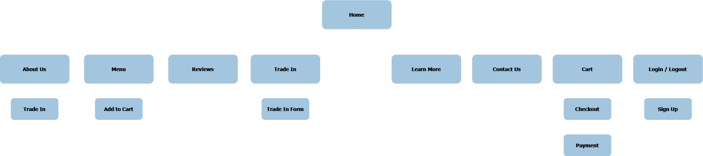

# ComfortX

CS2024 Web Project - An OEM to upsell an ergonomic mouse.

A pure front end project that simulates a full functional webpage

**Language Used:** HTML5, CSS3, Javascript

## **Directory Structure:**

```
ComfortX
└───assets
|   └───images
└───css
|   |   styles.css
|   |   index.css
|   |   ...
└───js
|   |   nav.js
|   |   notification.js
|   |   ...
|   README.md
|   index.html
|   about.html
|   menu.html
|   ...
```

## **Sitemap:**



## **Teammates**

1. Sean Young Song Jie
2. Min Htet Paing

**Contributions:**
| Sean | Min |
| :--: | :--: |
| index | about |
| menu functionalities | menu skeleton |
| signup / login | cart skeleton |
| trade-in / trade-in-form | contact |
| learn-more / explore-more |
| customise |
| reviews |
| pdpa / tos |
| cart functionalities |
| checkout / confirmation |
